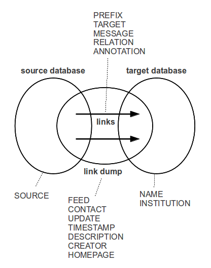

This git repository contains a specification of **BEACON link dump format** to
be prepared for publication as Request for Comment (RFC).

General information about BEACON, its application and a preliminary
specification can be found in the German Wikipedia at
<http://de.wikipedia.org/wiki/Wikipedia:BEACON/Format>.

# BEACON format

BEACON is a simple format to serialize a number of uniform links.  There is a
serialization as raw Unicode and a serialization in XML.  BEACON was primarily
used to collect mappings between authority files and information resources in
libraries and related organizations.

# Illustration

BEACON defines a link dump as set of links from a source database to a target database. Several parts can be described by meta fields (in uppercase):

# How to modify this specification

The specification of BEACON link dump format is being prepared in a public git
repository, located at <https://github.com/gbv/beaconspec>. It uses the
technique described in [RFC 7328](https://tools.ietf.org/html/rfc7328.html).

The specification is written in Pandoc Markdown syntax in the file `beacon.md`.
Additional parts are included in the file `appendices.md`, `rfctemplate.xml`,
and bibliographic references in the directory `ref`. To compile the
specification in RFC style there is a `Makefile`. To create a snapshot in HTML
and TXT format you need:

* [Pandoc](http://johnmacfarlane.net/pandoc/),
* an XSLT transformator (`xsltproc`),
* [xml2rfc](http://xml.resource.org/) version 2.

To install at Ubuntu Linux with Python, call:

    sudo apt-get install pandoc xsltproc xml2rfc
    sudo pip install xml2rfc

To further install `pandoc2rfc` after cloning the repository you must call:

    git submodule update --init

You can then modify `beacon.md`, `appendices.md`, `rfctemplate.xml` and create
a nice HTML version by simply invoking `make`.

# Snapshots and recent changes

Sources and recent changes can be found at <http://github.com/gbv/beaconspec>.
A snapshots in HTML formats is at <http://gbv.github.com/beaconspec/beacon.html>.

# Additional files

This repository also includes BEACON icons (`img/`) and tools to process BEACON
(`tools/`).
